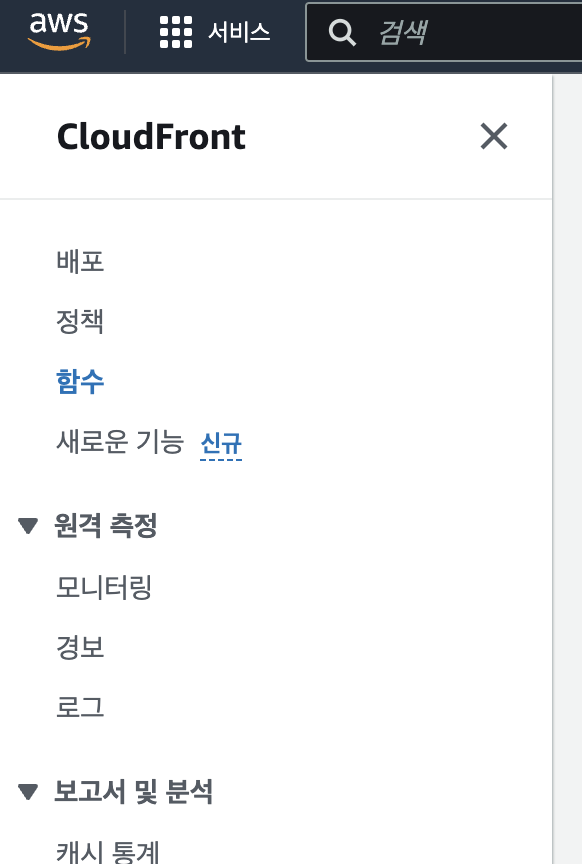

## 🚨 access denied,,,?

이제 게스트 페이지까지 뚝~딱 만들고 배포를 했습니다.
Github Action도 잘 돌아간것까지 확인했습니다!!

그리고 블로그도 쨘~ 하고 잘 떴습니다.
이제 게스트 페이지가 너무 텅텅~~ 비어있어서 친구한테 나....방명록 좀 남겨줘라고 부탁을 했습니다.

이거 깃허브 로그인 버튼 누르면 access denied 화면 뜨는디??? 모르겄다잉~

흐갸갹.. 제가 확인을 해보니 정말로 버튼을 누르면 저 화면이 뜨더랍니다.....

근데 계속해서 보니

utterances의 문제가 아니라 걍 게스트페이지로 접근을 못하고 있더랍니다.
그래서 의심스러운 것이 아!! 지금 CloudFront가 어떤 파일을 보여줘야 할 지 못찾고 있구나!

## 🧐 문제가 무엇이냐!

문제는 바로 index.html 때문이었습니다.

이게 뭔말..?

자 저는 정적 파일들을 S3에 올려놓고 이것을 CloudFront로 배포를 진행했습니다. 물론 S3를 통해서도 배포가 가능하지만 빠르고 효율적으로 제공하기 위해서 CloudFront를 사용했습니다.

따라서 public으로 배포되어져 있는 정적 파일들을 매칭시켜줘야 합니다. 허나 제 CloudFront는 여기서 "index.html" 이라는 파일명을 지정해주지 않아서 "내가 뭘 보여줘야 할 지 모르겄다잉.." 이러고 있는겁니다!

## 🔨 문제해결!

<a
  href="https://docs.aws.amazon.com/ko_kr/AmazonCloudFront/latest/DeveloperGuide/example-function-add-index.html"
  className="text-h-blue hover:text-blue-900"
>
  공식문서
</a>

아주 친절하게 이에 대한 해결법을 공식문서로 제공하고 있었습니다!

## 공식문서 따라하기

1. CloudFront에 접속

2. 함수 카테고리로 이동



3. 공식문서를 참조해 함수 생성 (제목과 설명은 자율)


코드는 아래와 같습니다.

```js
function handler(event) {
  var request = event.request;
  var uri = request.uri;

  // Check whether the URI is missing a file name.
  if (uri.endsWith("/")) {
    request.uri += "index.html";
  }
  // Check whether the URI is missing a file extension.
  else if (!uri.includes(".")) {
    request.uri += "/index.html";
  }

  return request;
}
```

이제 방명록을 남길 수 있게 되었습니다! 야호~
