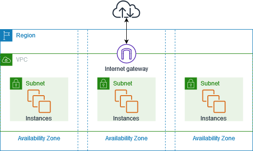

## 📍 VPC

공식문서에 따르면

Amazon Virtual Private Cloud(Amazon VPC)를 사용하면 정의한 논리적으로 격리된 가상 네트워크에서 AWS 리소스를 시작할 수 있습니다.

라고 하는데요... 뭔말인지 잘 와닿지 않습니다.

쉽게 알아보입시더!

## VPC 이해하기

VPC가 없다면 EC2 인스턴스들이 거미줄 처럼 연결되고 인터넷과 연결됩니다. (정리가 하나도 안되어 보이죵?)
이런식의 구조는 시스템의 복잡도를 엄청 끌어올립니다.
더불어!! 하나의 인스턴스를 추가하려고 하면 모든 인스턴스를 추가해야하는 번거로움이 생깁니다.

그래서 이걸 해결해 줄 놈이!!! 바로 **VPC** 다!

VPC를 적용하면 VPC 별로 네트워크를 구성할 수 있습니다.
각각의 VPC에따라 다르게 네트워크 설정을 줄 수 있습니다.
각각은 완전히 독립된 네트워크처럼 작동하게 됩니다.

## VPC 기능

- VPC
  - 가상 네트워크
- 서브넷
  - VPC의 IP 주소 범위
- IP 주소 지정
  - VPC 와 서브넷에 IP 주소를 IPv4 와 IPv6 모두 할당 할 수 있음
- 라우팅
  - 라우팅 테이블을 사용하여 서브넷 또는 게이트웨이 네트워크 트래픽이 전달되는 위치 결정
- 게이트웨이 및 엔드포인트
  - 게이트웨이는 VPC를 다른 네트워크에 연결
    - VPC 엔드포인트를 사용ㅇ하여 인터넷 게이트웨이 또는 NAT 를 사용하지 않고 AWS 서비스에 비공개로 연결합니다.
- 피어링 연결
  - 두 VPC의 리소스 간 트래픽을 라우팅
- 트래픽 미러링
  - 네트워크 인터페이스에서 네트워크 트래픽을 복사하고 심층 패킷 검사를 위해 보안 및 모니터링 어플라이언스로 전송
- Transit Gateway
  - 중앙 허브 역할을 하는 전송 게이트웨이를 사용하여, VPC, VPN 연결 및 AWS Direct Connect 연결 간에 트래픽을 라우팅
- VPC 흐름 로그
  - 흐름 로그는 VPC의 네트워크 인터페이스로 들어오고 나가는 IP 트래픽에 대한 정보를 캡쳐
- VPN 연결
  - 온프레미스 네트워크에 VPC를 연결

## VPC 만들어보기

1. IP 범위 설정

VPC의 아이피 범위를 `RFC1918` 사설 아이피 대역에 맞게 구축해야 합니다.

| VPC에서 사용하는 사설 아이피 대역                |
| ------------------------------------------------ |
| 10.0.0.0 ~ 10.255.255.255(10/8 prefix)           |
| 172.16.0.0 ~ 172.31.255.255(182.16/12 prefix)    |
| 192.168.0.0 ~ 192.168.255.255(192.168/16 prefix) |

한 번 설정된 아이피 대역은 수정할 수 없습니다.
각 VPC는 하나의 리전에 종속됩니다.
각각의 VPC는 완전히 독립적이기 때문에 VPC 간 통신을 원한다면 VPC 피어링 서비스를 고려하면 됩니다.

2. 서브넷

서브넷은 VPC를 잘게 쪼개는 과정입니다.
서브넷을 나누는 이유는 **더 많은 네트워크 망**을 만들기 위해서 입니다.

각각의 서브넷은 가용영역 안에 존재하면 서브넷안에 RDS, EC2와 같은 리소스들을 위치시킬 수 있습니다.

3. 라우팅 테이블과 라우터

네트워크 요청이 발생하면 데이터는 우선 라우터로 향합니다.
라우팅 테이블은 각 목적지에 대한 **이정표** 입니다.

4. IGW(인터넷 게이트 웨이)

IGW는 VPC와 인터넷을 연결해주는 하나의 관문입니다.

인터넷과 연결되어있는 서브넷을 퍼블릭 서브넷,
인터넷과 연결되어있지않은 서브넷을 프라이빗 서브넷 이라고 합니다.

5. 네트워크 ACL과 보안그룹

서브넷에 적용하는 방화벽 규칙입니다.

보안그룹별로도 별도의 트래픽을 설정할 수 있습니다. 서브넷 뿐만 아니라 각각의 EC2 인스턴스에도 적용할 수 있습니다.

6. NAT 게이트웨이

NAT 게이트웨이는 프라이빗서브넷이 인터넷과 통신하기위한 아웃바운드 인스턴스입니다.

프라이빗 서브넷 내 EC2 서버들도 외부접근이 가능해야할때가 있는데 그때 사용합니다.

퍼블릭 서브넷상에서 동작하는 **NAT** 게이트웨이는 프라이빗서브넷에서 외부로 요청하느 아웃바운드 트래픽을 받아 인터넷게이트웨이와 연결합니다.

그라믄 다음편은 실전으로 넘어가겠움미다!

---

**참고블로그**

  [Amazon VPC란
  무엇인가?](https://docs.aws.amazon.com/ko_kr/vpc/latest/userguide/what-is-amazon-vpc.html)
   
  [[AWS] 가장쉽게 VPC
  개념잡기](https://medium.com/harrythegreat/aws-%EA%B0%80%EC%9E%A5%EC%89%BD%EA%B2%8C-vpc-%EA%B0%9C%EB%85%90%EC%9E%A1%EA%B8%B0-71eef95a7098)

