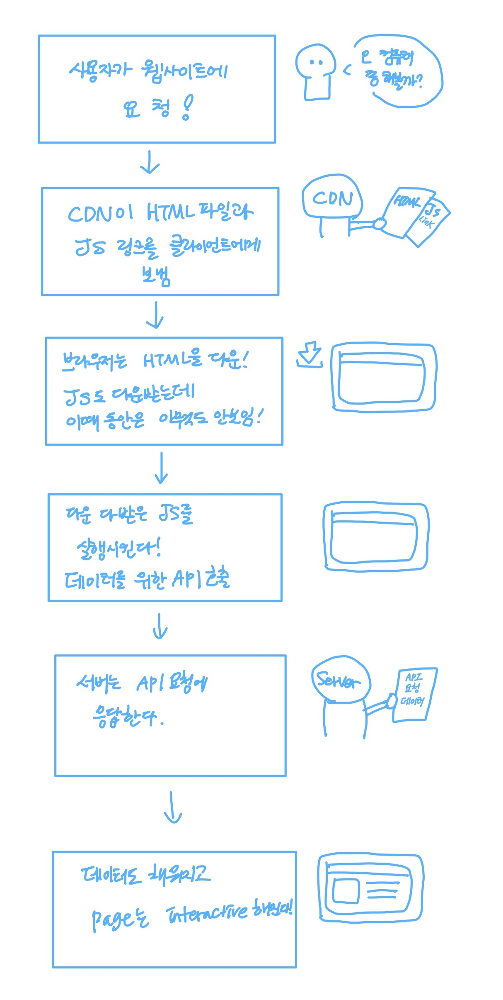
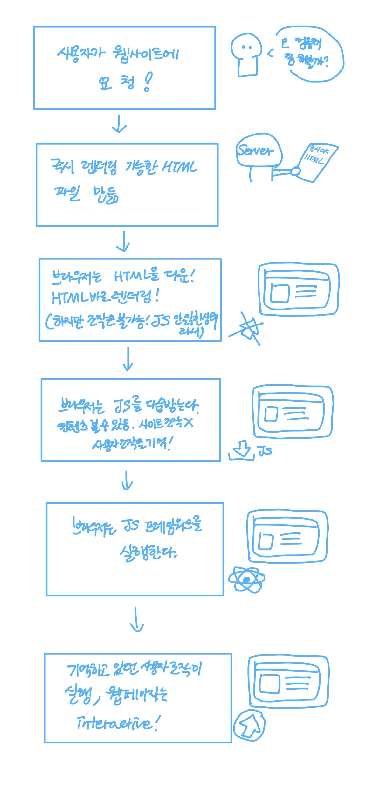

안녕하세요.

"왜 SSR 이 SEO에 좋은거죠?" 라는 질문을 받고 우물쭈물..말도 못하는 저를 보고 다시 공부해보자! 라는 마음으로 글을 쓰게 되었습니다!

그럼 레츄고

** 잠시 웨잇~~~!! **

CSR , SSR 살펴보기 전에 알아야 할 것 이 있다네요.

# SPA

:Single Page Application

이름만 보셔도 감이 오시죠?
한 페이지로만 구성된 홈페이지를 얘기합니다.

새로운 페이지 요청이 있을 때 페이지 갱신에 필요한 데이터만 전달받아서 페이지를 구성합니다.

하나의 페이지로만 구성되어져 있기 때문에 CSR에 적합합니다.

데이터를 수정,조회할 때 동적으로 페이지를 구성해서 페이지를 **새로고침** 하지않고 **다른페이지**로 넘어가지도 않습니다!

- 자연스러운 페이지 이동(화면 깜빡임X)
- 사용자 경험 제공

예시)
- react
- Angular
- Vue

# MPA

: Multi Page Application

그렇담 얘는 딱 봐도 SPA의 반대겠져?
여러개의 페이지로 이루어진 홈페이지를 뜻합니다.

새로운 페이지를 요청할 때마다 서버에서 렌더링된 정적 리소스(HTML, CSS, JS)가 다운되는 전통적인 웹페이지 구성방식입니다.

페이지를 이동하거나 새로고침하면 전체페이지를 다시 렌더링합니다.

여러개의 페이지로 구성되어져 있어 보통 SSR 환경을 사용합니다.
새로고침이 발생합니다.

예시)
- Java
- PHP

# CSR

: Client-Side-Rendering

렌더링이 클라이언트 쪽에서 일어난다.

최초에 한번 서버에서 전체 페이지를 로딩해서 보여줍니다. 이후에는 사용자의 요청이 올 때마다 리소스를 서버에서 제공한 후 클라이언트가 해석하고 렌더링을 하는 방식입니다.

# SSR

: Server-Side-Rendering

서버쪽에서 렌더링을 준비를 끝마친 상태로 클라이언트에 전달하는 방식

기존에 존재하던 방식으로 사용자가 웹페이지에 접근할 때 서버에서 페이지에 대한 요청을 하며 서버에서는 html,view와 같은 리소스들을 어떻게 보여질지 해석하고 렌더링하여 사용자에게 반환합니다.

# SSG

:Static-Site-Generation

클라이언트에서 필요한 페이지들을 미리 준비해뒀다가 요청을 받으면 이미 완성된 파일을 단순히 반환하여 브라우저에서 뷰를 보여지게 됩니다.

## 데이터 가져오는 SSG
리액트에서는 useEffect를 통해 데이터를 가지고 옵니다.

Next.js에서 useEffect를 사용하면 SSG로 작동하지 않습니다..!! 이렇게 짜고싶다면 Next에서 제공하는 getStaticProps 혹은 getStaticPaths를 사용하면 됩니다.

## 그롬...SSR과 SSG는 뭐가 다른건데..

서버에서 요청할 시!

- 즉시 만드냐? 
- 미리 만드냐?

요 두개의 차이 입니다.

**SSR**
요청 시 서버에서 즉시 HTML을 만들어서 응답하기 때문에 데이터가 달라져서 미리 만들어 두기 어려운 페이지에 적합합니다.

**SSG**
바뀔일이 거의 없어서 캐싱해두면 좋은 페이지에 사용합니다.

# ISR

:Incremental-Static-Regeneration

정적생성으로도 사용자에게 실시간으로 업데이트 된 페이지를 제공할 수 있습니다!

기존 SSG에서 **변화된 내용들을 전혀 제공해주지 못한다** 라는 점이 있었습니다. 
요것을 해결해주기 위해서 나온것이 **ISR**이라고 생각하면 됩니다!

---

**참고블로그**

[CSR과 SSR의 차이점](https://story.pxd.co.kr/1662) 
[CSR vs SSR vs SSG](https://ajdkfl6445.gitbook.io/study/web/csr-vs-ssr-vs-ssg) 
[SSR과 CSR의 차이](https://proglish.tistory.com/216) 
[렌더링 삼형제 CSR, SSR, SSG 이해하기](https://velog.io/@ka0son/%EB%A0%8C%EB%8D%94%EB%A7%81-%EC%82%BC%ED%98%95%EC%A0%9C-CSR-SSR-SSG-%EC%9D%B4%ED%95%B4%ED%95%98%EA%B8%B0) 
[NextJS와 ISR](https://velog.io/@seungchan__y/NextJS%EC%99%80-ISR)

